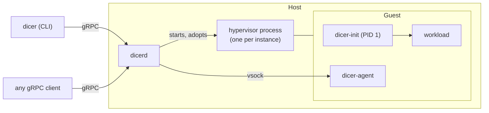

Dicer runs virtual machines from container images on one host. It has three
parts: a daemon that owns the host, a gRPC API it serves, and a small init
system and agent that run inside every guest.

## The daemon

`dicerd` runs as a systemd service and manages every instance on its host.
It keeps definitions and images under `/var/lib/dicer`, and runtime state,
such as sockets and what is running, under `/run/dicer`, which a reboot
clears.

Each running instance is a hypervisor process of its own, [Cloud Hypervisor
or Firecracker](../hypervisors). Both are built into `dicerd`, so there is
nothing else to install. The hypervisors outlive the daemon: restarting or
upgrading `dicerd` leaves guests running, and the new daemon adopts them when
it starts.

There is no cluster. A daemon owns the host it runs on; to manage several
hosts, run a daemon on each and point a client at whichever one you mean.

## The API

Everything Dicer does goes through one gRPC service, `dicerd.v1.DaemonService`.
The `dicer` command line is one client of it; any program can be another.
The daemon serves it on a Unix socket, `/run/dicer/dicer.sock`, and
optionally over TCP with TLS. See [Remote access](../../guides/remote-access)
and [the API reference](../../reference/api).

## The guest

A guest boots the kernel an instance names, with an initramfs that `dicerd`
builds from two binaries it carries:

- **`dicer-init`** is the guest's PID 1. It mounts the root filesystem,
  configures the network, the hostname and the instance's mounts, and then
  starts the workload, in one of two [init modes](../init-modes). When the
  workload ends, it reports how on a small status disk the host reads, and
  ends the machine.
- **`dicer-agent`** serves the daemon over vsock, a channel between host and
  guest that needs no network. It runs the commands `dicer exec` asks for,
  copies files for `dicer cp`, runs [health checks](../../guides/health-checks)
  and shuts the guest down when asked.

The guest's root filesystem is the image, read-only, with the instance's own
writable disk laid over it. See [Images](../images) and [Storage](../storage).
