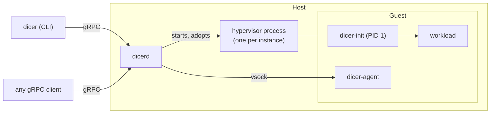

Dicer runs virtual machines from container images on one host. It has three
parts: a daemon that owns the host, a gRPC API it serves, and a small init
system and agent that run inside every guest.

```mermaid
flowchart LR
  cli["dicer (CLI)"] -- gRPC --> dicerd
  client["any gRPC client"] -- gRPC --> dicerd
  subgraph host["Host"]
    dicerd -- starts, adopts --> vmm["hypervisor process<br/>(one per instance)"]
    subgraph guest["Guest"]
      init["dicer-init (PID 1)"] --> workload
      agent["dicer-agent"]
    end
    vmm --- guest
    dicerd -- vsock --> agent
  end
```

## The daemon

`dicerd` runs as a systemd service and manages every instance on its host.
It keeps what must persist, such as definitions, images and disks, under
`/var/lib/dicer`. Runtime state, such as sockets and the record of what is
running, goes under `/run/dicer`, which a reboot clears. See
[Files and environment](../../reference/files-and-environment) for what each
holds.

Each running instance is a hypervisor process of its own, [Cloud Hypervisor
or Firecracker](../hypervisors). Both are built into `dicerd`, so there is
nothing else to install. The hypervisor processes outlive the daemon.
Restarting or upgrading `dicerd` leaves guests running, and the new daemon
adopts them when it starts.

There is no cluster. Each daemon owns the host it runs on. To manage several
hosts, run a daemon on each and point a client at the one you mean.

## The API

Everything Dicer does goes through one gRPC service, `dicerd.v1.DaemonService`.
The `dicer` command line is one client of it, and any program can be another.
The daemon serves it on a Unix socket, `/run/dicer/dicer.sock`. It can also
listen on a TCP address, which should be secured with TLS. See
[Remote access](../../guides/remote-access) and
[the API reference](../../reference/api).

## The guest

A guest boots the kernel its instance names, with an initramfs that `dicerd`
builds from two binaries it carries:

- **`dicer-init`** is the guest's PID 1. It mounts the root filesystem and
  sets up the network, the hostname and the instance's mounts. Then it starts
  the workload in one of two [init modes](../init-modes). When the workload
  ends, `dicer-init` records how it ended on a small status disk that the host
  reads, and ends the machine.
- **`dicer-agent`** serves the daemon over vsock, a channel between host and
  guest that needs no network. It runs the commands `dicer exec` asks for,
  copies files for `dicer cp`, lists processes for `dicer top`, and runs
  [health checks](../../guides/health-checks). It also shuts the guest down
  when asked, and sets the guest's clock after it resumes from standby or a
  snapshot.

The guest's root filesystem is the image, read-only, with the instance's
overlay disk laid over it. See [Images](../images) and [Storage](../storage).
