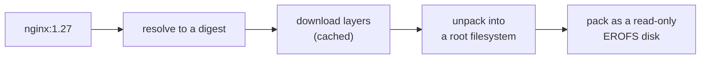

A guest boots from a container image: any OCI image from any registry, such
as `nginx:1.27` or `ghcr.io/acme/app:2`. Dicer converts it into a disk a
virtual machine can boot from.

## From image to disk

The disk is compressed and read-only, and one copy serves every instance
booting from the image. Each instance writes to a disk of its own, laid over
it, so instances never see each other's changes; see [Storage](../storage).
Downloaded layers are cached, so a new version of an image downloads only
what changed.

An image is kept by its digest. A tag such as `latest` means the image most
recently pulled under it on this host.

## What an instance takes from its image

From the image's configuration, an instance takes its `ENTRYPOINT` and `CMD`,
which the instance's own command replaces, its `ENV`, which the instance's
environment adds to, its `WORKDIR`, and its `HEALTHCHECK`, unless the
instance sets a [health check](../../guides/health-checks) of its own. Its `USER` is not applied: the workload runs as root.

What an image needs to be a machine rather than a container, a
[kernel](../kernels) and an init, Dicer supplies.

## Pulling

An image is pulled when an instance first needs it, or ahead of time with
`dicer pull`. Pulls of the same image share one download.

## Keeping and removing images

An image is **in use** while an instance is defined to boot from it, a
running guest booted from it, or a snapshot needs it. An image in use is not
deleted unless asked with `--force`; an instance defined to boot from it
pulls it again at its next start.

`dicer image prune` deletes every image not in use. The daemon can also do
so itself, removing images unused for longer than an age, or the least
recently used while the store is larger than a size. Images used in the last
ten minutes are always kept. See [Managing images](../../guides/managing-images).
