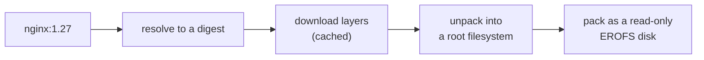

A guest boots from a container image: any OCI image from any registry, such
as `nginx:1.27` or `ghcr.io/acme/app:2`. Dicer converts it into a disk that a
virtual machine can boot from.

## From image to disk

```mermaid
flowchart LR
  ref["nginx:1.27"] --> resolve["resolve to a digest"]
  resolve --> download["download layers<br/>(cached)"]
  download --> unpack["unpack into<br/>a root filesystem"]
  unpack --> erofs["pack as a read-only<br/>EROFS disk"]
```

The disk is compressed and read-only, and one copy serves every instance
that boots from the image. Each instance writes to an overlay disk of its
own, laid over it, so instances never see each other's changes. See
[Storage](../storage). Downloaded layers are cached, so a new version of an
image downloads only the layers that changed.

An image is kept by its digest. A tag such as `latest` means the image most
recently pulled under it on this host.

## What an instance takes from its image

An instance takes these from the image's configuration:

| Image setting | How the instance uses it |
|---|---|
| `ENTRYPOINT` and `CMD` | Run as the workload. A command given to the instance replaces both. |
| `ENV` | Set in the workload's environment. The instance's own variables are added, and win over the image's. |
| `WORKDIR` | The workload's working directory. |
| `HEALTHCHECK` | Used unless the instance sets a [health check](../../guides/health-checks) of its own. |

`USER` is not applied: the workload runs as root.

An image has no [kernel](../kernels) and usually no init system. Dicer
supplies both, which is what turns a container image into a machine.

## Pulling

An image is pulled when an instance is created from it, or ahead of time with
`dicer pull`. Pulls of the same image share one download.

Whether creating an instance pulls its image depends on its **pull policy**,
set with `--pull` as with `docker run --pull`:

- `missing`, the default, pulls the image only if the host does not hold it.
- `always` pulls it even if the host holds it, so that a tag that has moved
  is followed. Nothing is downloaded if the host already has what the tag
  points at.
- `never` uses the image the host holds, and refuses to create the instance
  if it holds none. Creating the instance then contacts no registry.

Starting an instance pulls its image again if the host no longer holds it,
for example because it was deleted with `--force`.

## Keeping and removing images

An image is **in use** while an instance is defined to boot from it, a
running guest booted from it, or a memory snapshot's guest booted from it.
An image in use is not deleted unless asked with `--force`. An instance
defined to boot from it then pulls it again at its next start.

`dicer image prune` deletes every image not in use. The daemon can also do
this itself. It removes images unused for longer than a set age, or the
least recently used ones while the store is larger than a set size. It
always keeps images used in the last ten minutes. See
[Managing images](../../guides/managing-images).
