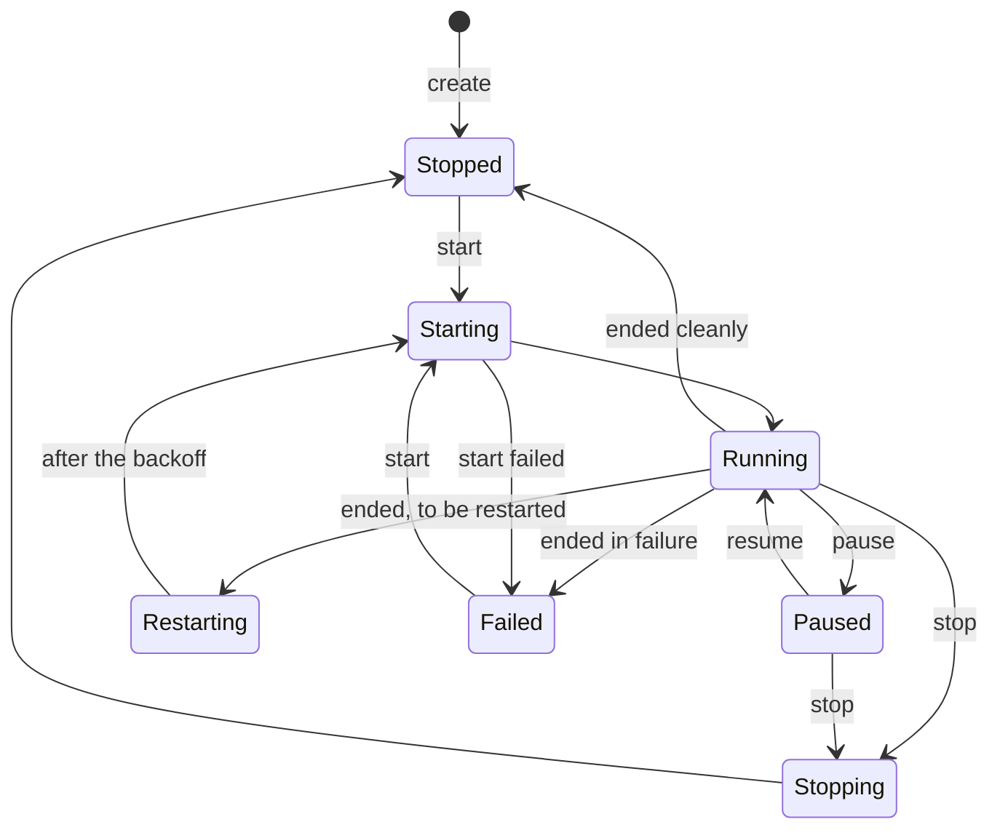

An instance is a virtual machine: a definition of what to run, and the state
of running it.

## Definition and state

The **definition** is what was asked for: the image, the command, vCPUs,
memory and disk, the network, ports, mounts, restart policy and so on. It
persists until the instance is deleted, across stops and reboots of the host.
Creating an instance only records it; nothing boots until it is started.

The **state** is what is happening now: whether it is running, since when,
its address, how it last ended, and its health. It is kept under the runtime
directory, so a reboot of the host clears it, and every instance is then
stopped.

An instance is known by its name, which can be changed while it is stopped,
and by an ID it keeps for its whole life.

## Lifecycle

| State | Meaning |
|---|---|
| Stopped | Defined, not running. A new instance starts here. |
| Starting | A start is in progress. |
| Running | The guest is running. |
| Paused | The guest's vCPUs are halted, and it stays in memory. |
| Stopping | A stop is in progress. |
| Restarting | The instance ended without being asked to, and its [restart policy](../../guides/restarts) will start it again. It holds nothing meanwhile. |
| Failed | The last start or run failed; the state says why. |

An instance holds its vCPUs and memory while it is starting, running or
paused. A start that would take more than the host allows is refused; see
[Capacity](../../guides/capacity).

## How an instance ends

An instance ends **cleanly** when its guest says so: the workload exits with
code 0, or the guest powers itself off. It is then Stopped.

Anything else is a **failure**: the workload exits with another code, the
guest resets, through a kernel panic or a reboot, or the hypervisor process
dies. The instance is then Failed, with the reason, unless its restart policy
starts it again.

The exit code the workload reported is kept, and shown as `dicer ps` shows a
container's: `Exited (1) 2 minutes ago`.

## Stopping

`dicer stop` asks the guest to shut down, as a power button would: the
workload gets SIGTERM, or systemd powers the machine off. If the guest has not
ended after 10 seconds, it is ended anyway. A stop keeps the instance's
definition, disk and address.

## Changing and deleting

- `dicer update` changes the definition of a stopped instance; it takes
  effect at the next start. The restart policy alone can be changed while it
  runs, and applies the next time it ends.
- `dicer rename` gives a stopped or failed instance a new name. It keeps its ID, disks
  and address.
- `dicer rm` deletes an instance: its disk, console log, snapshots and
  address. [Volumes](../storage#volumes) it mounted are kept. A running
  instance is only deleted with `--force`, which stops it first.

An instance created with `--rm` is deleted by the daemon once it stops,
unless its restart policy will start it again.
