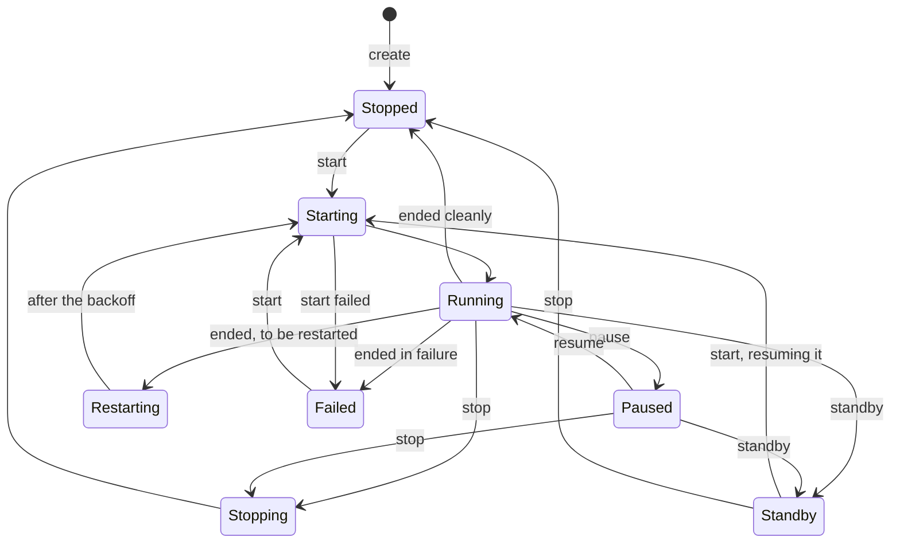

An instance is a virtual machine: a definition of what to run, and the state
of running it.

## Definition and state

The **definition** is what was asked for: the image, the command, vCPUs,
memory and disk, the network, ports, mounts, restart policy and so on. It
persists until the instance is deleted, across stops and reboots of the host.
Creating an instance only records it; nothing boots until it is started.

The **state** is what is happening now: whether it is running, since when,
its address, how it last ended, and its health. It is kept under the runtime
directory, so a reboot of the host clears it, and every instance is then
stopped.

An instance is known by its name, which can be changed while it is stopped,
and by an ID it keeps for its whole life.

## Lifecycle


```mermaid
stateDiagram-v2
  [*] --> Stopped: create
  Stopped --> Starting: start
  Starting --> Running
  Running --> Paused: pause
  Paused --> Running: resume
  Running --> Stopping: stop
  Paused --> Stopping: stop
  Running --> Standby: standby
  Paused --> Standby: standby
  Standby --> Starting: start, resuming it
  Standby --> Stopped: stop
  Stopping --> Stopped
  Running --> Stopped: ended cleanly
  Running --> Restarting: ended, to be restarted
  Restarting --> Starting: after the backoff
  Running --> Failed: ended in failure
  Starting --> Failed: start failed
  Failed --> Starting: start
```

| State | Meaning |
|---|---|
| Stopped | Defined, not running. A new instance starts here. |
| Starting | A start is in progress. |
| Running | The guest is running. |
| Paused | The guest's vCPUs are halted, and it stays in memory. |
| Standby | The guest is frozen to disk and its hypervisor ended, so it holds no CPU or memory. Starting it resumes it where it was. |
| Stopping | A stop is in progress. |
| Restarting | The instance ended without being asked to, and its [restart policy](../../guides/restarts) will start it again. It holds nothing meanwhile. |
| Failed | The last start or run failed; the state says why. |

An instance holds its vCPUs and memory while it is starting, running or
paused. A start that would take more than the host allows is refused; see
[Capacity](../../guides/capacity).

## Standby

`dicer standby` parks an instance that has nothing to do: its guest's memory
and device state are written to disk, under the instance's directory, and its
hypervisor ends, freeing every vCPU and byte of memory it held. Its disk stays
where it is, and its address, its published host ports and the volumes it
can write to stay its own: no other instance can take them while it is on
standby. A host reboot keeps it on standby.

`dicer start` resumes it where it was, its processes running on as if nothing
had happened but for the time, which is set as it wakes. Resuming takes the
time to read its memory back, and needs room on the host for its vCPUs and
memory, as a start does. Connections it had open to the outside have likely
been dropped by the other end meanwhile. `dicer stop` discards what it froze,
and the instance boots afresh at its next start; `dicer restart` does both.

What it froze takes as much disk as its memory: its memory is written to disk
in full. An instance on standby cannot be changed or renamed until it is
stopped, and its restart policy does not start it when the host boots.

### Automatic standby

An instance given `--standby-after`, or `standby_after` in a compose file, is
put on standby once it has been idle that long, at least a minute:

```console
$ dicer run -d --name preview --standby-after 15m nginx:1.27
```

The daemon judges every running instance that has one a minute at a time,
from the host, as `dicer stats` sees it: a minute is idle if its guest used
under 5% of one vCPU and its network carried under a packet a second, which
leaves room for background chatter such as NTP. It is put on standby after
an unbroken run of idle minutes as long as its `standby_after`; one busy
minute starts the count again. A paused instance is never put on standby: it
was paused on purpose.

Nothing wakes an instance on standby but a start: a connection to it, or to a
port it publishes, does not. An instance that waits on work it fetches
itself, polling a queue or a CI service, uses so little while it waits that
it may well look idle, and should not be given `--standby-after`.

`dicer update --standby-after` changes it, or turns it off with `0`, while
the instance runs, and the change applies at once.

## How an instance ends

An instance ends **cleanly** when its guest says so: the workload exits with
code 0, or the guest powers itself off. It is then Stopped.

Anything else is a **failure**: the workload exits with another code, the
guest resets, through a kernel panic or a reboot, or the hypervisor process
dies. The instance is then Failed, with the reason, unless its restart policy
starts it again.

The exit code the workload reported is kept, and shown as `dicer ps` shows a
container's: `Exited (1) 2 minutes ago`.

## Stopping

`dicer stop` asks the guest to shut down, as a power button would: the
workload gets SIGTERM, or systemd powers the machine off. If the guest has not
ended after 10 seconds, it is ended anyway. A stop keeps the instance's
definition, disk and address.

## Changing and deleting

- `dicer update` changes the definition of a stopped instance; it takes
  effect at the next start. The restart policy and `--standby-after` alone
  can be changed while it runs, and apply at once.
- `dicer resize` changes a running instance's vCPUs and memory, within the
  `--max-vcpus` and `--max-memory` it was started with. See
  [Resizing a running instance](../../guides/running-workloads#resizing-a-running-instance).
- `dicer rename` gives a stopped or failed instance a new name. It keeps its ID, disks
  and address.
- `dicer rm` deletes an instance: its disk, console log and address. Its
  [snapshots](../../guides/snapshots) are kept. [Volumes](../storage#volumes) it mounted are kept. A running
  instance is only deleted with `--force`, which stops it first.

An instance created with `--rm` is deleted by the daemon once it stops,
unless its restart policy will start it again.
