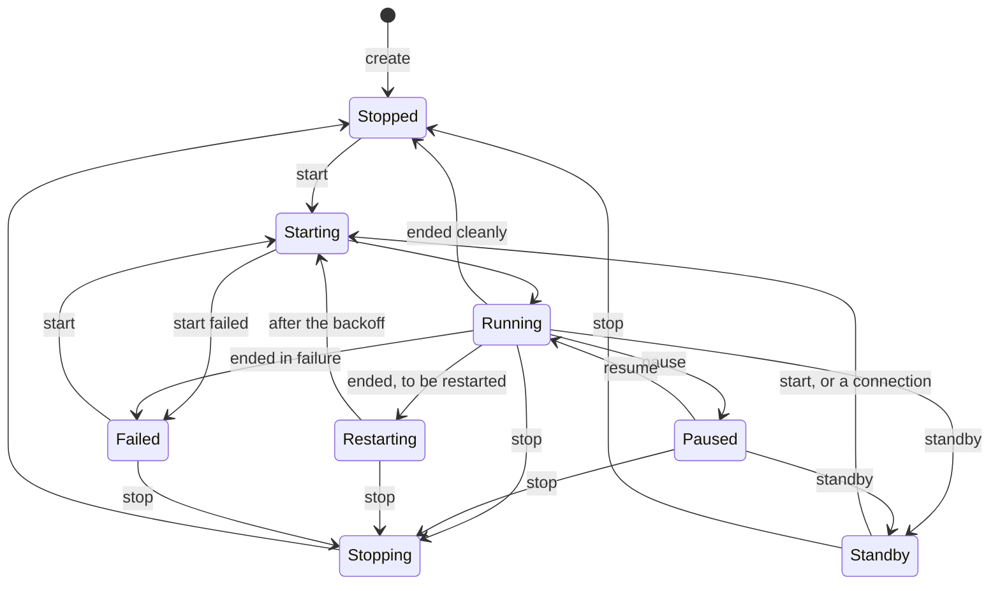

An instance is a virtual machine. It has a definition of what to run, and the
state of running it.

## Definition and state

The **definition** is what was asked for: the image, the command, vCPUs,
memory, the size of the overlay disk, the network, ports, mounts, restart policy and so on. It
persists until the instance is deleted, across stops and reboots of the host.

The **state** is what is happening now: whether it is running, since when,
its address, how it last ended, and its health. It is kept in the runtime
directory, which a reboot of the host clears. After a reboot every instance
is Stopped, except one on [standby](#standby), whose frozen guest is kept on
disk. Its [restart policy](../../guides/restarts) may then start it again.

An instance is known by its name and by an ID it keeps for its whole life.
The name can be changed only while the instance is stopped or failed.

`dicer create` defines an instance without booting it, and `dicer run`
defines one and starts it. `dicer fork` makes a new instance as a copy of
another; see [Forking](../../guides/snapshots#forking).

## Lifecycle

```mermaid
stateDiagram-v2
  [*] --> Stopped: create
  Stopped --> Starting: start
  Starting --> Running
  Starting --> Failed: start failed
  Running --> Paused: pause
  Paused --> Running: resume
  Running --> Stopping: stop
  Paused --> Stopping: stop
  Stopping --> Stopped
  Running --> Stopped: ended cleanly
  Running --> Failed: ended in failure
  Running --> Restarting: ended, to be restarted
  Restarting --> Starting: after the backoff
  Restarting --> Stopping: stop
  Failed --> Starting: start
  Failed --> Stopping: stop
  Running --> Standby: standby
  Paused --> Standby: standby
  Standby --> Starting: start, or a connection
  Standby --> Stopped: stop
```

| State | Meaning |
|---|---|
| Stopped | Defined, not running. A new instance starts here. |
| Starting | A start is in progress. |
| Running | The guest is running. |
| Paused | The guest's vCPUs are halted, and it stays in memory. |
| Stopping | A stop is in progress. |
| Restarting | The instance ended without being asked to, and its [restart policy](../../guides/restarts) will start it again. Nothing is committed to it meanwhile. |
| Failed | The last start or run failed, and the state says why. |
| Standby | The guest is frozen to disk and its hypervisor has ended, so no CPU or memory is committed to it. Starting it resumes it where it was. |

An instance's vCPUs and memory are committed to it while it is starting,
running or paused. A start that would take more than the host allows is refused. See
[Capacity](../../guides/capacity).

## How an instance ends

An instance ends **cleanly** when its guest says so: the workload exits with
code 0, or the guest powers itself off. It is then Stopped.

Anything else is a **failure**:

- the workload exits with another code;
- the guest resets, through a kernel panic or a reboot;
- the hypervisor process dies;
- a [health check](../../guides/health-checks) finds it unhealthy, and its
  restart policy would restart it.

The instance is then Failed, with the reason, unless its restart policy
starts it again.

The exit code the workload reported is kept, and `dicer ps` shows it as it
would for a container: `Exited (1) 2 minutes ago`.

## Stopping

`dicer stop` asks the guest to shut down, as a power button would. The
workload gets SIGTERM, or systemd powers the machine off. If the guest has
not ended after 10 seconds, it is ended anyway. A stop keeps the instance's
definition, overlay disk and address.

## Standby

Standby parks an instance that has nothing to do. Its guest's memory and
device state are written to disk, in the instance's directory, and its
hypervisor ends, so no CPU or memory is committed to it. Everything else
stays its own. Its overlay disk stays where it is, and no other instance can
take its address, its published host ports or the volumes it can write to.
Those volumes therefore cannot change under the frozen guest. See
[Volumes and frozen guests](../../guides/files-and-volumes#volumes-and-frozen-guests).
The instance stays on standby across a reboot of the host.

Starting it resumes the guest where it left off, with its processes and
memory as they were. Stopping it discards the frozen guest, and it boots
afresh at its next start.

An instance is put on standby with `dicer standby`, or by the daemon once
it has been idle for its `--standby-after`. An instance with
`--standby-after` is also woken by a connection to one of its published
ports. See [Standby](../../guides/standby).

## Changing and deleting

- `dicer update` changes the definition of a stopped instance, and the change
  takes effect at the next start. Only the restart policy and
  `--standby-after` can be changed while it runs or is on standby, and they
  apply at once.
- `dicer resize` changes a running instance's vCPUs and memory, within the
  `--max-vcpus` and `--max-memory` it was started with. See
  [Resizing a running instance](../../guides/capacity#resizing-a-running-instance).
- `dicer rename` gives a stopped or failed instance a new name. It keeps its
  ID, overlay disk and address.
- `dicer rm` deletes an instance, with its overlay disk, console log and
  address. Its [snapshots](../../guides/snapshots) and the
  [volumes](../storage#volumes) it mounted are kept. A running or paused
  instance is only deleted with `--force`, which stops it first.

An instance created with `--rm` is deleted by the daemon once it stops,
unless its restart policy will start it again.
