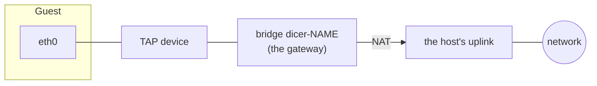

Instances are attached to networks: private IPv4 networks on the host, with
access to the outside world through the host.



## Networks

A network is a subnet and a bridge on the host that holds its gateway
address:

```console
$ dicer network create default --subnet 172.20.0.0/16
```

Unless given, its gateway is the subnet's first address, its nameserver is
`8.8.8.8`, and its MTU 1500. The bridge is created when the first instance on
the network starts. Networks are host-local; connecting guests on different
hosts means connecting the hosts.

An instance that names no network gets the daemon's default: the one its
configuration names, or, if there is exactly one network, that one.

## Addresses

An instance is given an address from its network's subnet when it first
starts, and keeps it for as long as it is defined, across stops and restarts.
`--ip` asks for a particular one. `dicer network allocation list` shows who
has which.

## The outside world

Traffic from guests leaves through the host's uplink with the host's address,
by NAT. The uplink is the interface of the host's default route, unless the
daemon's configuration names another.

## Isolation

Guests on different networks cannot reach each other. A network created with
`--isolated` also stops its own guests reaching each other; each can still
reach its gateway and, through NAT, the outside.

Dicer's firewall rules are in chains of their own. Rules of yours go in
`DICER-USER`, which is consulted first and which Dicer leaves alone.

## Publishing ports

A guest's port is reached from outside the host by publishing it on a host
port, as with containers:

```console
$ dicer run -d -p 8080:80 nginx:1.27
$ dicer run -d -p 192.0.2.10:53:53/udp dns-server
```

Traffic to the host port, on every address the host has or on the one given,
is forwarded to the guest. Traffic to the host's loopback addresses is not.
A host port already in use, by a process or another instance, is refused.
