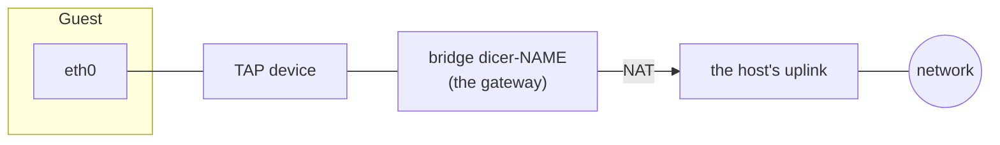

Instances are attached to networks: private IPv4 networks on the host, with
access to the outside world through the host.


```mermaid
flowchart LR
  subgraph guest["Guest"]
    eth0
  end
  eth0 --- tap["TAP device"]
  tap --- bridge["bridge dicer-NAME<br/>(the gateway)"]
  bridge -- NAT --> uplink["the host's uplink"]
  uplink --- internet((network))
```

## Networks

A network is a subnet and a bridge on the host that holds its gateway
address:

```console
$ dicer network create default --subnet 172.20.0.0/16
```

Unless given, its gateway is the subnet's first address, its upstream
nameserver `8.8.8.8` (see [Names](#names)), and its MTU 1500. The bridge is
created when the first instance on the network starts. Networks are
host-local; connecting guests on different hosts means connecting the hosts.

A subnet may not overlap another network's, nor one the host is already on,
such as its LAN's: the network's routes would hide the host's.

An instance that names no network gets the daemon's default: the one its
configuration names, or, if there is exactly one network, that one.

## Addresses

An instance is given an address from its network's subnet when it first
starts, and keeps it for as long as it is defined, across stops and restarts.
`--ip` asks for a particular one. `dicer network allocation list` shows who
has which.

## Names

Instances on a network find each other by name. The daemon answers its
guests' DNS queries on the network's gateway address, which is the
nameserver they are given: a running instance's name or hostname resolves to
its address, bare or followed by the network's name.

```console
$ dicer run -d --name db --network default postgres:17
$ dicer run -d --name app --network default alpine:3.21 sleep infinity
$ dicer exec app ping -c 1 db.default
PING db.default (172.20.0.5): 56 data bytes
…
```

Other names are asked of the network's nameservers, `8.8.8.8` unless it was
created with `--nameservers`, so the guests' view of the outside world is
the host's. Addresses on the network resolve back to their instances' names;
nobody outside is asked about them.

On a host that runs firewalld, its `dicer` zone lets guests ask: see
[firewalld](#firewalld).

A stopped instance's name does not resolve. On a network created with
`--isolated`, whose guests cannot reach each other, no instance's does: the
daemon answers only for [the host](#the-host), and forwards the rest.

The daemon answers only while it runs: a guest that looks a name up while
it is restarting gets no answer, and should ask again. With `network.dns`
turned off in the [daemon's configuration](../../reference/configuration#network-dns),
guests are given the network's nameservers instead, and find each other only
by address.

### The host

A guest reaches the host as `host.dicer.internal`, which resolves to its
network's gateway, the host's address on the network; `gateway.dicer.internal`
is the same. They resolve on every network, isolated ones too, so a guest
can use a database or an API running on the host without knowing its
address:

```console
$ dicer exec app wget -qO- http://host.dicer.internal:8000/
```

The service on the host must listen on the gateway's address, or on all of
the host's, not only on `127.0.0.1`; and the host's firewall must let its
port in from the guests: with firewalld, add it to the `dicer` zone, as
[firewalld](#firewalld) shows.
 `dicer.internal` is never asked of upstream: any
other name under it does not resolve.

## The outside world

Traffic from guests leaves through the host's uplink with the host's address,
by NAT. The uplink is the interface of the host's default route, unless the
daemon's configuration names another.

## Rate Limits

`--upload-rate` and `--download-rate` limit the bytes per second a guest
sends and receives. The host shapes its traffic on its TAP device, so the
limits work the same on either hypervisor and cover everything the guest
sends: to the outside, to the host and to other guests. See
[Rate limits](../../guides/running-workloads#rate-limits).

## Isolation

Guests on different networks cannot reach each other. A network created with
`--isolated` also stops its own guests reaching each other; each can still
reach its gateway and, through NAT, the outside.

Dicer's firewall rules are in chains of their own. Rules of yours go in
`DICER-USER`, which is consulted first and which Dicer leaves alone.

## firewalld

On a host that runs firewalld, the daemon puts each network's bridge in the
`dicer` zone, which the package and the install script install. As
libvirt's zone does, it lets guests' traffic be forwarded, as Dicer's own
rules allow, and lets guests reach the host itself only for DNS, which the
daemon answers on each gateway (see [Names](#names)), and by ICMP. firewalld
flushes Dicer's rules and forgets the bridges whenever it starts or
reloads; the daemon sets them up again each time.

To let guests reach another service on the host, as
[`host.dicer.internal`](#the-host), add it to the `dicer` zone, which only
Dicer's bridges are in:

```console
$ sudo firewall-cmd --permanent --zone=dicer --add-port=8000/tcp
$ sudo firewall-cmd --reload
```

## Publishing ports

A guest's port is reached from outside the host by publishing it on a host
port, as with containers:

```console
$ dicer run -d -p 8080:80 nginx:1.27
$ dicer run -d -p 192.0.2.10:53:53/udp dns-server
```

Traffic to the host port, on every address the host has or on the one given,
is forwarded to the guest. Traffic to the host's loopback addresses is not.
A host port already in use, by a process or another instance, is refused.
