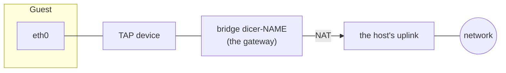

Instances are attached to networks: private IPv4 networks on the host. Each
guest reaches the outside world through the host.


```mermaid
flowchart LR
  subgraph guest["Guest"]
    eth0
  end
  eth0 --- tap["TAP device"]
  tap --- bridge["bridge dicer-NAME<br/>(the gateway)"]
  bridge -- NAT --> uplink["the host's uplink"]
  uplink --- internet((network))
```

## Networks

A network is a subnet, and a bridge on the host that holds the network's
gateway address:

```console
$ dicer network create default --subnet 172.20.0.0/16
```

What `dicer network create` does not set takes a default:

| Setting | Flag | Default |
|---|---|---|
| Gateway | `--gateway` | The subnet's first address |
| Upstream nameservers | `--nameservers` | `8.8.8.8` (see [Names](#names)) |
| MTU | `--mtu` | 1500, and between 576 and 9000 if given |

A subnet is IPv4, and no smaller than a /30. It may not overlap another
network's subnet, or one the host is already on, such as its LAN's. The
network's routes would hide the host's.

The bridge is named `dicer-NAME`, or `dbr-` and a hash of the name when that
is too long for an interface name. It is created when the first instance on
the network starts, and removed when the last one stops.

Networks are local to their host. To connect guests on different hosts,
connect the hosts.

An instance that names no network gets the daemon's default: the one
`defaults.network` names in its
[configuration](../../reference/configuration#defaults-network), or the only
network, if there is exactly one.

## Addresses

An instance is given a free address from its network's subnet when it first
starts. The address is picked at random, not in order, so don't count on
which one an instance gets. Reach instances by [name](#names) instead, or
give one a fixed address with `--ip`. The instance keeps its address
across stops and restarts until it is deleted, or until its network or `--ip`
is changed with `dicer update`. `dicer network allocation list NETWORK`
shows which instance holds which address.

A [fork](../../guides/snapshots#forking) is a new instance, so it gets an
address and a MAC address of its own.

## Names

Instances on a network find each other by name. The daemon answers its
guests' DNS queries on the network's gateway address, which is the
nameserver they are given. A running instance's name or hostname resolves to
its address, either bare or followed by the network's name:

```console
$ dicer run -d --name db --network default postgres:17
$ dicer run -d --name app --network default alpine:3.21 sleep infinity
$ dicer exec app ping -c 1 db.default
PING db.default (172.20.0.5): 56 data bytes
…
```

The daemon asks the network's upstream nameservers about every other name,
so the guests see the outside world as the host does. On an
[internal network](#internal-networks) it asks nobody, and every other name
does not resolve. Reverse lookups of the network's own addresses resolve to
their instances' names, and are never sent upstream.

Only running and paused instances resolve. The name of an instance that is
stopped or on [standby](../instances#standby) does not. On a network created
with `--isolated`, whose guests cannot reach each other, no instance's name
resolves. There the daemon answers only for [the host](#the-host), and sends
everything else upstream.

The daemon answers only while it runs. A guest that looks a name up while the
daemon is restarting gets no answer, and should ask again. With `network.dns`
turned off in the daemon's
[configuration](../../reference/configuration#network-dns), guests are given
the network's upstream nameservers instead, and find each other only by
address.

On a host that runs firewalld, the `dicer` zone lets guests' DNS queries in.
See [firewalld](#firewalld).

### The host

A guest reaches the host as `host.dicer.internal`, which resolves to the
network's gateway: the host's address on the network.
`gateway.dicer.internal` is the same. Both resolve on every network but an
[internal](#internal-networks) one, isolated networks too, so a guest can
use a database or an API running on the host without knowing its address:

```console
$ dicer exec app wget -qO- http://host.dicer.internal:8000/
```

The service on the host must listen on the gateway's address, or on all of
the host's addresses. One that listens only on `127.0.0.1` cannot be reached.
With firewalld, add the port to the `dicer` zone, as [firewalld](#firewalld)
shows.


Without firewalld, Dicer does not limit what guests can reach on the host.
Every service on the host that listens on an address other than
`127.0.0.1`, such as SSH, can be reached from every guest, at that address.
Bind a service that guests must not reach to `127.0.0.1`, block guests
from it in the host's firewall, or put the guests on an
[internal network](#internal-networks). Guests can never reach the daemon's
own API, whatever address it listens on.


Names under `dicer.internal` are never sent upstream. Any name there other
than these two does not resolve.

## The outside world

Traffic from guests leaves through the host's uplink, with the host's
address, by NAT. The uplink is the interface of the host's default route,
unless `network.uplink_interface` in the daemon's
[configuration](../../reference/configuration#network-uplink-interface)
names another. The host must forward IPv4 (`net.ipv4.ip_forward=1`), which
the packages and the install script turn on. Without it, an instance does
not start.

## Isolation

Guests on different networks cannot reach each other, nor another network's
gateway. A network created with `--isolated` also stops its own guests
reaching each other. Each can still reach its gateway and, through NAT, the
outside world.

### Internal networks

A network created with `--internal` keeps its guests from reaching anything
beyond it. It suits code you don't trust, such as a sandbox for untrusted
jobs:

```console
$ dicer network create sandbox --subnet 172.31.0.0/24 --internal
```

Its guests cannot reach:

- the outside world;
- other networks;
- any service on the host;
- upstream nameservers.

They can still reach each other, unless the network is also `--isolated`.
The gateway answers their DNS queries about the network's own instances,
and nothing else. `host.dicer.internal` does not resolve either.

Connections into the network still work. A port published with `-p` can be
reached from outside the host, and a connection still wakes an instance on
[standby](../../guides/standby#waking-on-a-connection). An internal network
takes no `--nameservers`, and a network cannot be made internal after it is
created.

Dicer keeps its iptables rules in chains of its own, whose names start with
`DICER-`. Put rules of your own in `DICER-USER`. It is consulted before
Dicer's other rules, and Dicer leaves it alone.

## firewalld

On a host that runs firewalld, the daemon puts each network's bridge in the
`dicer` zone, which the packages and the install script install. Like
libvirt's zone, it lets guests' traffic be forwarded, as far as Dicer's own
rules allow. It lets guests reach the host itself only by ICMP, and for DNS,
which the daemon answers on each gateway (see [Names](#names)).

firewalld flushes Dicer's rules and forgets the bridges whenever it starts or
reloads. The daemon sets them up again each time.

Without the `dicer` zone, firewalld turns guests' traffic away, both to the
host and beyond it, and the daemon's log warns that it does. That happens
where Dicer was built from source without the install script. To check that
a network's bridge is in the zone, for a network named `default`:

```console
$ sudo firewall-cmd --get-zone-of-interface=dicer-default
dicer
```

To install the zone from a checkout of the repository:

```console
$ sudo cp build/package/firewalld-zone.xml /etc/firewalld/zones/dicer.xml
$ sudo firewall-cmd --reload
```

The daemon puts the bridges in it when firewalld reloads.

To let guests reach another service on the host, as
[`host.dicer.internal`](#the-host), add its port to the `dicer` zone. Only
Dicer's bridges are in that zone:

```console
$ sudo firewall-cmd --permanent --zone=dicer --add-port=8000/tcp
$ sudo firewall-cmd --reload
```

## Publishing ports

To reach a guest's port from outside the host, publish it on a host port, as
with containers:

```console
$ dicer run -d -p 8080:80 nginx:1.27
$ dicer run -d -p 192.0.2.10:53:53/udp dns-server
```

Traffic to the host port, on every address the host has or on the one
given, is sent to the guest by DNAT rules. Traffic to the host's loopback
addresses is not: `curl localhost:8080` on the host does not reach the
guest. Use the host's own address, or the guest's.

An instance does not start if one of its host ports is already in use,
whether by a process or by another instance that is running, paused or on
standby.

While an instance with `--standby-after` is on standby, the daemon listens on
its published TCP ports in place of the DNAT rules. A connection wakes the
instance, and the daemon relays it to the guest. See
[Waking on a connection](../../guides/standby#waking-on-a-connection).

## Rate limits

`--upload-rate` and `--download-rate` limit the bytes per second a guest
sends and receives. The host shapes the guest's traffic on its TAP device,
so the limits work the same under either hypervisor. They cover everything
the guest sends and receives: to and from the outside world, the host and
other guests. See [Rate limits](../../guides/running-workloads#rate-limits).
