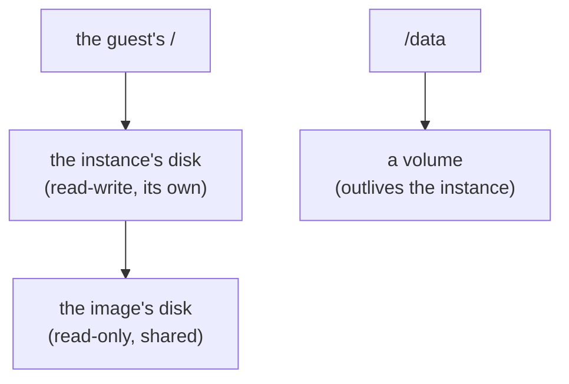

An instance sees one root filesystem, and whatever is mounted into it. Behind
them are several disks.



## The instance's disk

The guest's root filesystem is its [image](../images), read-only, with a disk
of the instance's own over it. Every change the guest makes, to any file, is
written there. The disk is created on the instance's first start, with the
size `--disk` gives, and is kept across stops and restarts until the
instance is deleted.

Disks are sparse: one takes up only what the guest has written, however
large it is.


  A disk's size is fixed when it is created. Changing an instance's `--disk`
  afterwards does not resize the disk it already has.


## Volumes

A volume is a disk that exists apart from any instance, for data that must
outlive it:

```console
$ dicer volume create pgdata --size 20GiB
$ dicer run -d --mount source=pgdata,target=/data ghcr.io/acme/app:2
```

It is attached to the guest as a disk of its own and mounted at the target.
Deleting the instance keeps the volume; a volume is only deleted by
`dicer volume rm`, and not while any instance is defined to mount it.

A volume is used read-write by one running instance at a time. Mounted
read-only by all of them, it can be shared. An instance can mount up to 22
volumes.

## Other mounts

Besides volumes, an instance can mount a copy of a file from the host, and an
empty in-memory filesystem. See [Files and volumes](../../guides/files-and-volumes).

| Type | Source | Lifetime |
|---|---|---|
| `volume` | a volume | Persistent; outlives the instance. |
| `file` | a host file | A copy, made at each start: a change on the host reaches the guest at its next start, and one made in the guest is lost when it stops. |
| `tmpfs` | none | In memory; lost when the guest stops. |
