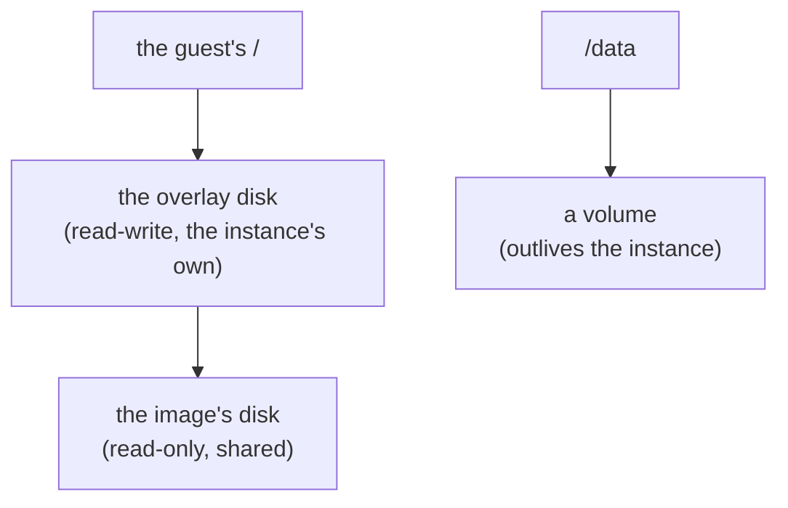

An instance sees one root filesystem, and whatever is mounted into it.
Several disks lie behind them.


```mermaid
flowchart TB
  root["the guest's /"] --> overlay["the overlay disk<br/>(read-write, the instance's own)"]
  overlay --> image["the image's disk<br/>(read-only, shared)"]
  vol["/data"] --> volume["a volume<br/>(outlives the instance)"]
```

## The overlay disk

The guest's root filesystem is its [image](../images), read-only, with a disk
of the instance's own laid over it: its **overlay disk**. Every change the
guest makes, to any file, is written to the overlay disk. It is created on
the instance's first start, with the size `--disk` gives, 10 GiB by default.
It is kept across stops and restarts until the instance is deleted.

Disks are sparse: each takes up only the space the guest has written to it,
however large it is.


  An overlay disk's size is fixed when it is created. Changing an
  instance's `--disk` afterwards does not resize the overlay disk it
  already has.


## Volumes

A volume is a disk that exists apart from any instance, for data that must
outlive it:

```console
$ dicer volume create pgdata --size 20GiB
$ dicer run -d --mount source=pgdata,target=/data ghcr.io/acme/app:2
```

It is attached to the guest as a disk of its own and mounted at the target.
Deleting the instance keeps the volume. A volume is only deleted by
`dicer volume rm`, and not while any instance is defined to mount it.

While an instance can write to a volume, no other instance can use it. The
instance keeps the volume to itself while it runs, is paused or is on
standby. A volume that every instance mounts read-only can be shared by any
number of them. An instance can mount up to 22 volumes.

## Rate limits

`--disk-rate` and `--disk-iops` limit the bytes and operations per second at
which each of an instance's disks can be read and written. The hypervisor
enforces them. See [Rate limits](../../guides/running-workloads#rate-limits).

## Mounts

Besides volumes, an instance can mount a copy of a file from the host, and
an empty in-memory filesystem. Each kind suits a different job:

| Type | For | Source | Lifetime |
|---|---|---|---|
| `volume` | Data that must outlive the instance | A volume | Until the volume is deleted. It outlives the instance. |
| `file` | Configuration from the host | A file on the host | A copy, made at each start. A change on the host reaches the guest at its next start, and a change made in the guest is lost when it stops. |
| `tmpfs` | Scratch space | None | In the guest's memory. Its contents are lost when the guest stops. |

[Files and volumes](../../guides/files-and-volumes) shows how to use each.
