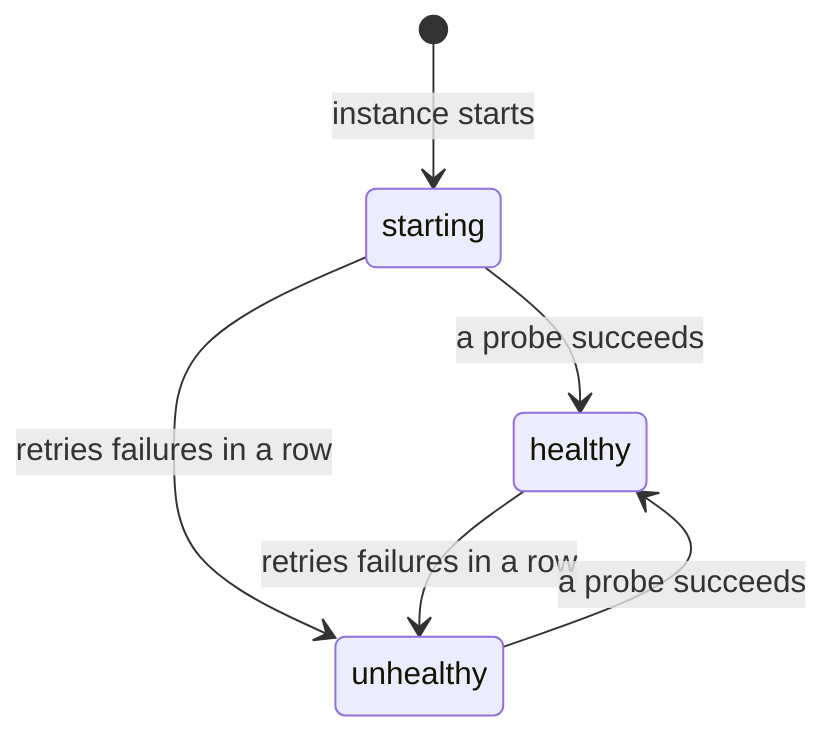

A running instance is not necessarily a working one: a server can be up and
answering nothing. A health check asks the workload, from inside the guest,
whether it is well, and records the answer.

## Add a check

A check is one of three probes, all run inside the guest by its agent:

| Flag | Healthy when |
|---|---|
| `--health-http PORT[/path]` | An HTTP GET to `127.0.0.1:PORT/path` answers 2xx or 3xx. Redirects are not followed. |
| `--health-tcp PORT` | A connection to `127.0.0.1:PORT` is accepted. |
| `--health-cmd 'COMMAND'` | The command, run by `/bin/sh`, exits 0. |

```console
$ dicer run -d --name api -p 8080:3000 --health-http 3000/healthz ghcr.io/acme/api:3
$ dicer run -d --name db --health-cmd 'pg_isready -U postgres' postgres:17
$ dicer run -d --name cache --health-tcp 6379 redis:7
```

The HTTP and TCP probes need nothing in the image, so they suit minimal
images with no shell. A command runs with the instance's environment, and
what it prints is kept as the check's output.

## Timing

| Flag | Default | |
|---|---|---|
| `--health-interval` | 10s | Time from the end of one probe to the start of the next. The first runs one interval after the start. |
| `--health-timeout` | 5s | A probe that takes longer has failed. |
| `--health-retries` | 3 | Failures in a row that make the instance unhealthy. |
| `--health-start-period` | none | Time after a start in which failures do not count, for a workload that is slow to come up. A success counts at once. |

```console
$ dicer run -d --name search \
    --health-http 9200/_cluster/health \
    --health-interval 30s --health-start-period 2m \
    ghcr.io/acme/search:8
```

## What the answers mean



An instance is `starting` until its first probe succeeds. One success makes
it `healthy`; `--health-retries` failures in a row, outside the start
period, make it `unhealthy`; and one success makes it `healthy` again.

Health is shown beside the state:

```console
$ dicer ps --columns name,status
NAME   STATUS
api    Up 5 minutes (healthy)
$ dicer inspect api
…
     Health: healthy, checked 6 seconds ago
             http :3000/healthz every 10s
```

Each change is also an event, `healthy` or `unhealthy`, with the probe's
output:

```console
$ dicer events --name api
```

A paused instance is not probed, and a new start, of the instance or of the
daemon, begins again at `starting`.

## When an instance is unhealthy

What happens depends on the instance's [restart policy](../restarts):

- **`no`**, the default: nothing. The instance is reported unhealthy and
  keeps running, for you to look into.
- **`on-failure`, `unless-stopped` or `always`**: the daemon stops the
  instance, as `dicer stop` would, and it ends as a failure, with the reason
  "health check … failed 3 times in a row". Its restart policy then starts
  it again, and the restart counts towards an `on-failure` limit.

So a check and a restart policy together keep a workload that hangs, and
does not exit, running:

```console
$ dicer run -d --name api --restart on-failure:5 --health-http 3000/healthz ghcr.io/acme/api:3
```


  Docker only reports an unhealthy container, whatever its restart policy.
  Dicer restarts it, if its restart policy restarts failures.


## The image's own check

An image's `HEALTHCHECK` is used when the instance sets none, timings
included. A check given with flags replaces it whole, and `--no-healthcheck`
turns health checking off, the image's check with it.

## Changing a check

A check is part of the instance's definition, so it is changed on a stopped
instance with `dicer update`, and a check given there replaces the old one
whole:

```console
$ dicer stop api
$ dicer update api --health-http 3000/readyz
$ dicer start api
```
