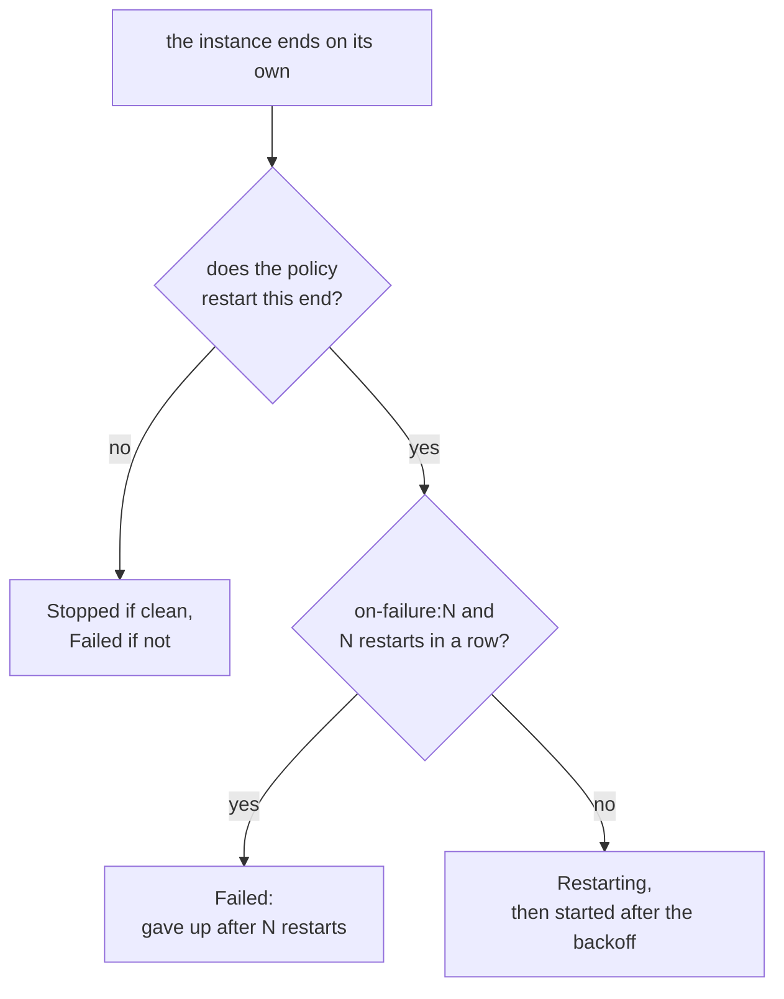

An instance that ends on its own, because its workload exited or crashed,
stays ended unless its restart policy says otherwise. An instance that was
only ever meant to run once can instead be deleted when it ends.

## Restart policies

A restart policy is set with `--restart`:

```console
$ dicer run --name api --restart unless-stopped ghcr.io/acme/api:3
```

| Policy | Restarts after an end that was | Started when the daemon starts |
|---|---|---|
| `no` (default) | never | no |
| `on-failure[:N]` | a failure; at most `N` times in a row, if `N` is given | no |
| `unless-stopped` | clean or a failure | yes, unless you stopped it |
| `always` | clean or a failure | yes, even if you stopped it |

An end is **clean** when the workload exits with code 0 or the guest powers
itself off, and a **failure** otherwise: another exit code, a kernel panic,
a reboot, the hypervisor dying, or a [health check](../health-checks)
failing. See [Instances](../../concepts/instances#how-an-instance-ends).



## Stopping is not ending

A restart policy acts only on an instance that ends without being asked to.
`dicer stop` is never undone by one, whatever the policy: the instance stays
stopped until it is started again.

Where the policies differ is when the daemon starts, as it does after the
host reboots or `dicerd` is restarted or upgraded. Then it starts every
stopped or failed instance whose policy is `always`, and every one whose
policy is `unless-stopped` that was not last stopped with `dicer stop`.

Use `unless-stopped` for a service that should come back with the host, but
stay down when you take it down. Use `always` for one that must come back
regardless.

## Backoff

An instance that keeps ending is restarted after a growing delay: 1 second,
then 2, 4, 8 and so on, up to 5 minutes. A run of 10 minutes or more resets
the count, as does starting the instance yourself.

While it waits, the instance is **Restarting**, and holds no CPU or memory:

```console
$ dicer ps --columns name,status
NAME   STATUS
api    Restarting (3) in 7 seconds
```

`dicer inspect` shows why it last ended, and how many times in a row it has
restarted. `dicer stop` cancels the pending restart.

## Giving up

An `on-failure:N` instance that has failed `N` times in a row is left
**Failed**, with the reason:

```console
$ dicer inspect api
…
     Active: failed, exited (1) 2 minutes ago
             gave up after 5 restarts: …
    Restart: on-failure:5, restarted 5 times in a row
```

Fix what is wrong, then start it again; starting resets the count.
`on-failure` without a limit, like `unless-stopped` and `always`, tries for
ever, at most once every 5 minutes.

## Changing a policy

The restart policy is the one part of a definition that can be changed while
the instance runs. The change applies the next time it ends:

```console
$ dicer update api --restart on-failure:5
```

## Temporary instances

An instance created with `--rm` is deleted by the daemon when it ends,
however it ends, and when it is stopped:

```console
$ dicer run --rm --name migrate ghcr.io/acme/api:3 ./migrate up
```

Its disk, console log and address go with it; [volumes](../files-and-volumes)
it mounted are kept. To read why a temporary instance failed, follow its
log while it runs, with `dicer logs -f`.

`--rm` cannot be combined with a restart policy that restarts: an instance
cannot be both deleted and restarted when it ends.
