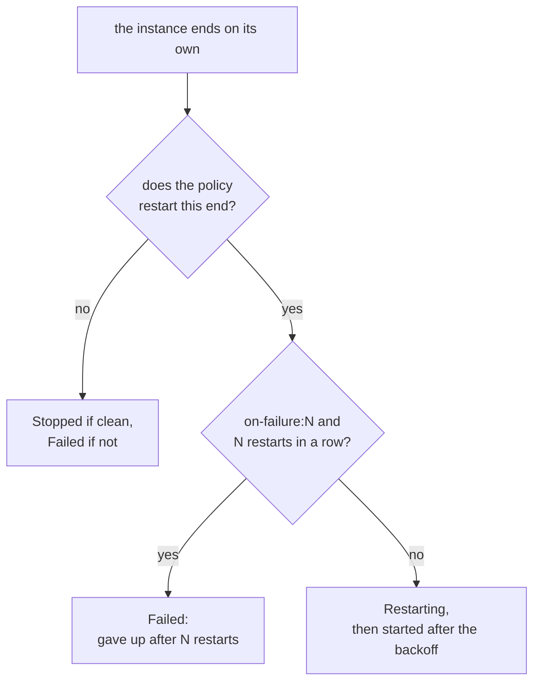

An instance that ends on its own, because its workload exited or crashed,
stays ended unless its restart policy says otherwise. An instance that was
only meant to run once can instead be deleted when it ends.

## Restart policies

Set a restart policy with `--restart`:

```console
$ dicer run -d --name api --restart unless-stopped ghcr.io/acme/api:3
```

| Policy | Restarts after | Started when the daemon starts |
|---|---|---|
| `no` (default) | nothing | no |
| `on-failure[:N]` | a failure, at most `N` times in a row if `N` is given | no |
| `unless-stopped` | a clean end or a failure | yes, unless you stopped it |
| `always` | a clean end or a failure | yes, even if you stopped it |

An end is **clean** when the workload exits with code 0 or the guest powers
itself off. Anything else is a **failure**: another exit code, a kernel
panic, a reboot, the hypervisor dying, or a
[health check](../health-checks) failing. See
[How an instance ends](../../concepts/instances#how-an-instance-ends).


```mermaid
flowchart TD
  ended["the instance ends on its own"] --> wants{"does the policy<br/>restart this end?"}
  wants -- no --> final["Stopped if clean,<br/>Failed if not"]
  wants -- yes --> limit{"on-failure:N and<br/>N restarts in a row?"}
  limit -- yes --> gaveup["Failed:<br/>gave up after N restarts"]
  limit -- no --> restarting["Restarting,<br/>then started after the backoff"]
```

## Stopping is not ending

A restart policy acts only on an instance that ends without being asked to.
It never undoes `dicer stop`: a stopped instance stays stopped until it is
started again, whatever its policy.

The policies differ when the daemon starts, as it does after the host
reboots or `dicerd` is restarted or upgraded. The daemon then starts every
stopped or failed instance whose policy is `always`. It also starts every
one whose policy is `unless-stopped`, unless it was last stopped with
`dicer stop`.

Use `unless-stopped` for a service that should come back with the host but
stay down when you take it down. Use `always` for one that must come back
regardless.

## Backoff

An instance that keeps ending is restarted after a growing delay: 1 second,
then 2, 4, 8 and so on, up to 5 minutes. The count starts again after a run
of 10 minutes or more, or when you start the instance yourself.

While it waits, the instance is **Restarting**, and has no CPU or memory
committed to it:

```console
$ dicer ps --columns name,status
NAME  STATUS
api   Restarting (3) in 7 seconds
```

`dicer inspect` shows why the instance last ended, and how many times in a
row it has been restarted. `dicer stop` cancels the pending restart.

## Giving up

An `on-failure:N` instance that has failed `N` times in a row is left
**Failed**, with the reason:

```console
$ dicer inspect api
…
     Active: failed, exited (1) 2 minutes ago
             gave up after 5 restarts: …
    Restart: on-failure:5, restarted 5 times in a row
```

Fix what is wrong, then start it again. Starting it resets the count.
`on-failure` without a limit, like `unless-stopped` and `always`, keeps
trying for ever, at most once every 5 minutes.

## Changing a policy

Most of an instance's definition can only be changed while it is stopped.
The restart policy and `--standby-after` are the exceptions. You can change
the restart policy in any state, and the change applies the next time the
instance ends.

```console
$ dicer update api --restart on-failure:5
```

## Temporary instances

An instance created with `--rm` is deleted by the daemon when it ends,
however it ends, and when it is stopped:

```console
$ dicer run --rm --name migrate ghcr.io/acme/api:3 ./migrate up
```

Its overlay disk, console log and address are deleted with it. The
[volumes](../files-and-volumes) it mounted are kept. When run without `-d`,
as above, `dicer run` writes the console as the job runs and exits with the
job's exit code. So if the job fails, you see why before the instance is
gone.

`--rm` cannot be combined with a restart policy that restarts, because an
instance cannot be both deleted and restarted when it ends.
